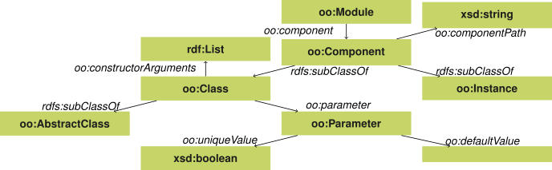
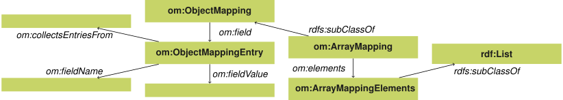

## Describing components and their configuration
{:#describing-components}

In this section, we introduce the _Object-Oriented Components_ ontology for describing software components and their instantiation in a certain configuration.
We provide an example of the application of this vocabulary to object-oriented software components using JavaScript.

### Object-oriented components

Within the [_Object-Oriented Components ontology_](https://linkedsoftwaredependencies.org/vocabularies/object-oriented),
we reuse Fowler's definition of a [software component](cito:providesQuotationFor DependencyInjection) as a "glob" of software.
The purpose of a component is to provide operations that can be used by other components.
The instantiation of a component can require certain parameters,
just like object-oriented programming (OOP) languages allow constructors to have certain arguments.
In this section, we assume OOP in the broad sense of the word, which only requires _classes_, _objects_ and _constructor parameters_.
[](#voc-oo-diagram) shows an overview of the ontology.

<figure id="voc-oo-diagram">

<figcaption markdown="block">
Classes and properties in the [_Object-Oriented Components_ ontology](https://linkedsoftwaredependencies.org/vocabularies/object-oriented#){:.mandatory},
with as prefix `oo`.
</figcaption>
</figure>

Following [](#describing-modules), we have defined a _module_ as a collection of components.
Within OOP languages, this can correspond to for example a software library or an application,
which can contain a multitude of components.

We define component as a _subclass_ of `rdfs:Class`.
The parameters to construct a component can therefore be defined as an `rdfs:Property` on a component.
This class structure enables convenient semantic descriptions of components instantiations
through the regular `rdf:type` predicate.
For instance,
a software module representing a parser
can be described as
`ldfs:Datasource/Hdt a oo:Class.`,
and a concrete instance is
`:myHdtDatasource a ldfs:Datasource/Hdt`.


Several `oo:Component` subclasses are defined.
An `oo:Component` can be an `oo:Class`, which means that it can be instantiated based on parameters.
Each component can refer to its path within a module using the `oo:componentPath` predicate,
which can for instance be the package name in Java.
All instantiations of `oo:Class` instances are an `oo:Instance`.
An `oo:Class` can also be `oo:AbstractClass`, which does not allow directly instantiating this component type.
Abstract components can be used to define a set of shared parameters in a common ancestor.
Conforming to the RDF semantics, components can have multiple ancestors, and are indicated using the `rdfs:subClassOf` predicate.

The parameters that are used to instantiate an `oo:Class` to an `oo:Instance` are of type `oo:Parameter`.
An `oo:Parameter` is a _subclass_ of `rdfs:Property`, which simplifies its usage as an RDF property.
`oo:defaultValue` allows parameters to have a default value when no other values have been provided:
upon instantiation ([](#instantiating)),
a closed world will be assumed.
The `oo:uniqueValue` predicate is a flag that can be set to indicate whether or not the parameter can only have a single value.

[](#module-ldf) shows a simplified example of the LDF server npm module using the components ontology.
It exposes several components such as an HDT and SPARQL datasource and a QPF server,
each of which can take multiple parameters.
These are provided with a unique identifier and definition,
such that the software configuration can receive a semantic interpretation.
For example,
[](#config-ldf) illustrates how instances can be created of these component types.

<figure id="module-ldf" class="listing">
````/code/module-ldf.ttl````
<figcaption markdown="block">
The LDF server module contains, amonst others, an HDT and SPARQL-based datasource component, which both extend from the abstract datasource component.
The HDT and SPARQL datasource are a classes, which both inherit the title parameter from the abstract datasource.
The HDT datasource takes an HDT file as parameter.
The SPARQL datasource takes a SPARQL endpoint URI as parameter.
</figcaption>
</figure>

<figure id="config-ldf" class="listing">
````/code/config-ldf.ttl````
<figcaption markdown="block">
`ex:myServer` is a TPF server which will be loaded with a HDT and SPARQL-based datasource.
</figcaption>
</figure>

### Object mapping

A consequence of using RDF to instantiate components is that the parameters have no fixed order.
While this is sufficient to describe component instantiations on a semantic level,
it is insufficient for mapping parameter values to arguments in method and constructor calls that are based on a fixed ordering for parameters,
which is the case for most popular OOP languages.

We introduce a new ontology for describing the mapping between the pure semantic parameters
to arguments in method calls in OOP languages like JavaScript, hence the name [_Object Mapping ontology_](https://linkedsoftwaredependencies.org/vocabularies/object-mapping).
[](#voc-om-diagram) shows an overview of all the classes and predicates in the ontology.

<figure id="voc-om-diagram">

<figcaption markdown="block">
Overview of the classes and properties in the _Object Mapping_ ontology, with as prefix [`om`](https://linkedsoftwaredependencies.org/vocabularies/object-mapping#){:.mandatory}.
</figcaption>
</figure>

The ontology introduces the _object mapping_ and the _array mapping_, the latter is a subclass of the former.
An object map can have several _object mapping entries_, where each entry has a field name and a field value.
An array map can have several _array mapping entries_, where each entry only has a value.

If the value of `om:fieldName` or `om:fieldValue` is a literal, the literal value will be mapped to the object field name or value.
An `om:fieldValue` can also refer to another object map, which will be mapped to the resulting object.
`om:collectsEntriesFrom` can refer to a predicate that points to entities with certain predicates.
Each entity predicate that is refered to by `om:fieldName` will have its values mapped to keys of the object.
Each entity predicate refered to by `om:fieldValue` will have its values mapped to values.

[](#module-ldf-mapped) shows the mapping of the LDF component parameters to the constructor implementations.
This description enchances the component definitions from [](#module-ldf)
as it provides a lower level (implementation) view on the component constructors.

<figure id="module-ldf-mapped" class="listing">
````/code/module-ldf-mapped.ttl````
<figcaption markdown="block">
The HDT and SPARQL-based datasource constructors both take require a single object as argument for the constructor.
The entries of this object are mapped from the parameter values using this mapping.
The TPF server constructor similarly requires a single object,
where the `datasources` entry points to an object that is a mapping from datasource title to datasource.
</figcaption>
</figure>
