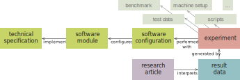

## Introduction
Too many computer science articles
that contain experimental software evaluations
identify that software only by name and, sometimes, version number.
This information is insufficient for readers
to understand which _exact_ version of the software,
which exact versions of its _dependencies_,
and which detailed _configuration_ of the software's components
has in fact obtained the reported results.
Therefore, potential users cannot necessarily obtain the correct software installation
that will behave according to the article's conclusions.
Moreover, other researchers might fail
in reproducing the same results
because of differences in any of these aspects.

As [Claerbout's Principle](cite:providesQuotationFor WaveLab) explains,
<q>an article about computational science in a scientific publication
is not the scholarship itself, it is merely **advertising** of the scholarship.
The actual scholarship is the complete software development environment
and the complete set of instructions which generated the figures.</q>
This stresses the importance of reproducibility,
and essentially mandates a detailed description
of the executed experiment, the involved artefacts and actors,
and the processing of the retrieved data.

Using Linked Data to publish such descriptions provides two immediate benefits:
the experimental setup and parts thereof can be _identified with IRIs_,
and their details can be retrieved by _dereferencing those IRIs_.
Therefore, if research articles complement their textual explanation of an experiment
with the IRI of the full setup, reproducibility is guaranteed

"Guaranteed" may be too strong?
{:.todo}
Moreover, the IRIs of the entire experiment or its parts
can be reused in other articles or experiment
to unambiguously refer to the same conditions.
 illustrates how this leads to a chain of provenance
from the research article to the data
and the experiment that generates it,
and all the aspects surrounding that experiment.

<figure id="description-diagram">

<figcaption markdown="block">
A _research article_ is based on _result data_,
which are the outcomes of an _experiment_.
The experiment in turn also has (multiple) provenance chains,
and this article focuses on _software configurations_ and _software modules_.
</figcaption>
</figure>

In this article,
we focus on the description of _software configurations_ and _software modules_,
such that an evaluated software setup
can be referred to unambiguously by an IRI.
We thereby avoid the inherent vagueness
of referring to software by name only.
We further facilitate the reproduction of experiments
through a mechanisms that automatically _instantiates_ the software configuration
based on its Linked Data description.
Our contributions are the following:

- the RDF-based description of **software modules**,
  applied to the 475,000+ bundles of the npm ecosystem for Node.js;
- the RDF-based description of **available components** within software modules;
- the RDF-based description of a **precise configuration** of software modules;
- the **automated instantiation** of such a configuration;
- a **use case** explaining the usage of the resulting Linked Data
  in scientific articles.

{:.todo} Would a figure explaining the relation between module, component, configuration and instance be useful here?
